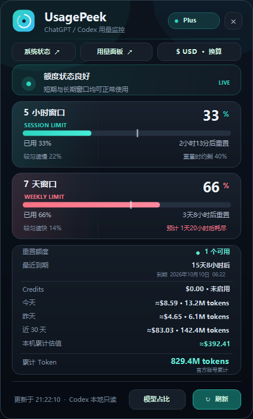

# UsagePeek

一个轻量的 Windows 系统托盘用量查看器，当前专注于 ChatGPT 账号下的
Codex 用量。数据通过本机 Codex 提供的只读接口和本机会话元数据获取。

> **与 OpenUsage 的关系：** UsagePeek 是从
> [OpenUsage](https://github.com/robinebers/openusage) 的界面、用量统计、
> 节奏预测和 Provider 思路改造成的 Windows/C# 版本。它是独立的社区实现，
> 不是 OpenUsage 官方 Windows 客户端。原项目作者与 MIT 许可署名见
> [THIRD_PARTY_NOTICES.md](THIRD_PARTY_NOTICES.md)。

<p align="center">
  
</p>

## 下载

推荐从 [GitHub Releases](https://github.com/Supaio/UsagePeek/releases/latest)
下载单文件版，也可以[直接下载最新版 UsagePeek.exe](https://github.com/Supaio/UsagePeek/releases/latest/download/UsagePeek.exe)。
无需安装；放在个人目录后直接运行。如果只检测到受保护的 Codex 桌面版，
点击“修复连接”即可获取官方 Codex CLI 运行组件。

## 当前功能

- 5 小时 Session 与 7 天 Weekly 用量、剩余量和重置倒计时。
- 按当前消耗速度显示相对匀速的快慢，并预测额度耗尽时间或重置时余量。
- 可用 Rate Limit Reset 次数、最近一张重置额度的到期时间。
- 仅在确认检测到新的重置卡发放时显示托盘通知；首次读取只建立基线，
  卡被使用、过期、刷新失败或旧详情补回时不会误报。
- Credits / Extra Usage 余额。
- 今天、昨天、近 30 天的本机 Token 与 API 等价费用估算。
- 默认以美元显示费用；点击顶部 `$ USD` 会联网取得最新工作日 USD/CNY
  参考汇率并切换为人民币，再点一次切回美元。
- **本机累计估值**：按仍保存在本机的 Codex 会话计算累计 API 等价费用。
- **累计 Token**：优先显示 Codex 官方返回的账号历史累计；若当前版本或
  账号不支持，则回退为这台电脑现存本地记录的累计值。
- 一键打开 OpenAI 系统状态页和 ChatGPT Codex 官方用量面板。
- 启动缓存、后台刷新、托盘左键展开、右键刷新或退出。
- 托盘菜单可开关“开机自启”；自启时只驻留托盘，不主动弹窗。
- 托盘菜单支持联网检查更新，下载后先校验 SHA-256，再由独立更新进程
  替换并重启程序。
- 如果只检测到受 Windows 保护的桌面版组件，离线界面会显示“修复连接”。
  用户确认后，程序从 OpenAI 官方地址获取 Windows Codex CLI 安装器，安装到
  当前用户目录并自动重试，不要求 Node.js、PATH 配置或管理员权限。

## 数据口径

### 官方账号数据

UsagePeek 通过 Codex app-server 调用：

- `account/rateLimits/read`：额度窗口、Credits、重置额度及到期时间。
- `account/usage/read`：账号累计 Token 和官方每日活动桶。

账号累计可能包含其他设备或不完全出现在本机日志里的后台用量，因此它与
本机累计不一定相同。官方接口不支持时，界面会自动显示本机记录口径。

### 本机日用量

今天、昨天和近 30 天来自 `CODEX_HOME`（默认 `%USERPROFILE%\.codex`）下的
`sessions` 与 `archived_sessions`。扫描器只解析 `turn_context` 和
`token_count` 元数据，不保存提示词、回复或工具输出。

统计按累计计数的增量计算，并忽略累计值未变化的重复事件；复制到分叉或
子代理会话中的相同历史也只计一次。日期按 Windows 当前本地时区分组。

### 费用估算

费用前的 `≈` 表示它是按 OpenAI 公开 API 标准价格计算的等价估算，**不是
ChatGPT 订阅账单，也不会从账号扣款**。估算区分普通输入、缓存输入、缓存
写入、输出及长上下文价格（价格表基准：2026-09-19）。`gpt-reserve` 按
Luna、`codex-auto-review` 按 Sol 的公开等价价格估算；其他无法识别的模型
显示 `$--`，不会猜测金额。

人民币金额同样只是显示换算。汇率由 Frankfurter 的免密钥 HTTPS 接口提供，
按最新工作日参考数据更新，不是盘中交易报价；切换到 CNY 时才发出请求，
请求内容只有固定的 USD/CNY 货币对，不包含账号或用量数据。

## 隐私与凭据

- 复用已登录的 Codex，本程序不读取、复制或保存 `auth.json` 中的令牌。
- 不发送遥测，不上传本机会话数据。
- 重置卡通知只在本地保存可用数量和发放/观察时间，用于去重。
- “修复连接”仅下载并运行 `https://chatgpt.com/codex/install.ps1` 官方安装器；
  UsagePeek 本身仍不打开、复制或输出登录令牌。
- `%LOCALAPPDATA%\UsagePeek\cache.json` 只保存聚合后的套餐、百分比、时间、
  Token 和估算金额，不包含账号 ID、Cookie、访问令牌或对话正文。

> 当前显示的是 ChatGPT 登录下的 **Codex 使用额度与 Token 活动**，不是普通
> ChatGPT 对话消息数。个人 ChatGPT Windows 客户端没有稳定、公开的通用
> 消息用量 API。

## 运行要求

- Windows 10 或 Windows 11
- .NET Framework 4.x
- 已登录的 Codex 桌面版、CLI 或 IDE 扩展；若缺少可运行 CLI，可在 UsagePeek
  中点击“修复连接”完成当前用户级安装

新版 Codex 可提供官方累计 Token 和重置额度详情；旧版仍可显示额度窗口，
并自动使用本机会话记录补足 Token 统计。

### 为什么打开桌面版仍可能显示离线

UsagePeek 需要自己启动一个只读的 `codex app-server`。Windows 商店安装的
Codex/ChatGPT 桌面版可能把内置 `codex.exe` 放在受保护的 WindowsApps 包中；
桌面应用自己能启动它，不代表普通第三方程序也有权限。因此只打开 Chappy、
Codex 或 ChatGPT 窗口并不能保证连接成功。

新版会自动查找以下来源：

1. `USAGEPEEK_CODEX_PATH` 指定的位置；
2. 官方独立安装目录和系统 `PATH`；
3. VS Code、VS Code Insiders、Cursor 的 `openai.chatgpt` 扩展；
4. Codex Windows 桌面包；
5. npm、pnpm、Scoop 的常见命令位置。

如果界面提示桌面组件受 Windows 保护，请另行安装官方 Codex CLI，在 Windows
终端运行一次 `codex` 并选择 ChatGPT 登录，然后重新刷新；也可以直接点击新版
界面底部的“修复连接”，由 UsagePeek 调用 OpenAI 官方安装器并自动重试。
若 Codex 配置为在 WSL 中运行，WSL 默认使用另一份 `~/.codex`；需要让 WSL
与 Windows 共用 `CODEX_HOME`，或在 Windows 原生 CLI 中单独登录一次。

## 构建与运行

```powershell
cd usagepeek
.\build.cmd
.\bin\UsagePeek.exe
```

程序启动后会出现在系统托盘。左键单击图标可显示或隐藏面板；右键可刷新或
退出，也可切换“开机自启”。如果 Codex 不在自动探测的位置，可将完整路径放入
`USAGEPEEK_CODEX_PATH`，支持 `codex.exe` 或 `codex.cmd`。

给其他人测试时，技术上只需要发送 `UsagePeek.exe`。建议让对方把它放在桌面或
个人文件夹后运行；如果出现桌面组件受保护提示，点击“修复连接”即可。首次修复
需要联网，并会明确询问确认，不会静默安装。

## 联网更新

公开版本默认从 `Supaio/UsagePeek` 的 `update.json` 检查更新；下载完成后会
核对 SHA-256，并在用户确认后原地替换。也可以通过环境变量
`USAGEPEEK_UPDATE_URL`，或以下文件覆盖默认清单地址：

```text
%LOCALAPPDATA%\UsagePeek\update-url.txt
```

清单格式见 `update-manifest.example.json`：

```json
{
  "version": "0.3.3",
  "url": "https://example.com/releases/UsagePeek.exe",
  "sha256": "64 位十六进制 SHA-256",
  "notes": "更新说明"
}
```

发布新版本时可用
`(Get-FileHash .\bin\UsagePeek.exe -Algorithm SHA256).Hash` 生成校验值。配置后，
程序每次启动会静默检查一次，也可从托盘菜单手动检查；发现新版本后仍会先询问，
不会静默安装。当前程序所在目录必须可写，建议放在个人目录而不是 Program Files。

## 验证

解析与本地增量/去重测试：

```powershell
.\tests\run.ps1
```

渲染预览：

```powershell
.\tests\render.ps1
```

已登录机器上的端到端只读检查：

```powershell
.\tests\run-live.ps1
```

联网汇率检查：

```powershell
.\tests\run-exchange-live.ps1
```

官方 CLI 安装源检查（只下载并校验脚本，不执行安装）：

```powershell
.\tests\run-bootstrap-source-live.ps1
```

## 设计取舍

项目从 OpenUsage 的托盘交互、节奏预测、Provider 抽象和本地用量聚合思路
改造而来，并针对 Windows 原生环境重新实现。当前没有加入多账号、遥测、
本地 HTTP API 或重置额度消费操作；重置额度只查看、不使用，避免不可逆操作。

数据获取层继续实现 `IUsageProvider`，未来可增加自部署 DeepSeek Provider，
无需重写托盘和主界面。Codex app-server 是随本地工具演进的接口；实时读取
失败时，UsagePeek 会保留最近成功数据并明确标为缓存。
